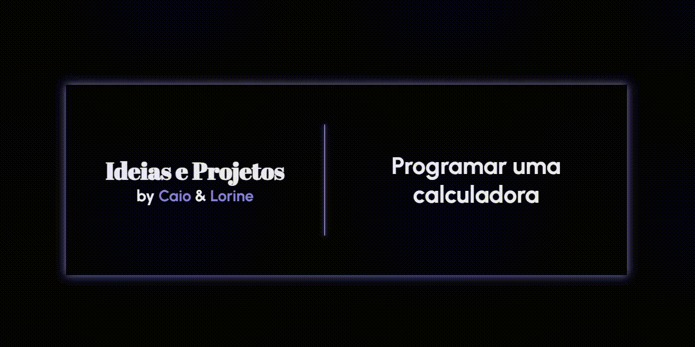

# Ideias e Projetos por Caio e Lorine

Um site que lista **todas as ideias** que eu, Caio, e minha amiga Lorine já tivemos. Um lembrete pessoal para
todas as horas que dizemos que não tem nada pra fazer.   

Esse é um projeto criado com o intuito de práticar HTML, CSS e JavaScript, tentando implementar elementos dinâmicos, 
responsividade e animações para trazer a página a vida.   

🔗 **Veja agora mesmo**: https://ideias-caio-lorine.vercel.app/

## 🌟 Funcionalidades

- **Transições de Texto Dinâmico**: Texto dinâmico alimentado por JavaScript
- **Animações CSS**: Transições e animações de CSS para trazer a página a vida!
- **Design Responsivo**: Adaptado para ser bonito em qualquer tipo de tela!
- **Light/Dark Mode**: Opções de modo claro e noturo detectados automaticamente pelo seu sistema!

## 🛠 Technologies Used
- **HTML5**: Estruturação de conteúdo.
- **CSS3**: Estilização e animações.
- **JavaScript**: Criação de elementos dinâmicos.

## 📧 Contato
- Caio Abrahão: contato.caioabrahao@gmail.com
    - [GitHub](https://github.com/caioabrahao)
    - [LinkedIn](https://www.linkedin.com/in/caioabrahao/)
    - Discord: @zaicoba

 
Made with ❤️ by Caio